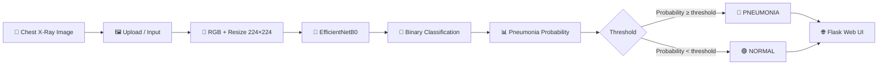

<div align="center">

# 🫁 ChestXray AI
### Pneumonia Classification from Chest X-Ray Images

<p>
  <b>An end-to-end Deep Learning + Flask web application for binary chest X-ray image classification.</b>
</p>

<p>
  <a href="https://github.com/Govind99603/pneumonia_chest_xray">
    
  </a>
  <a href="https://chest-xray-ai-model-by-govind-suthar.onrender.com/">
    
  </a>
  
  
  
  
</p>

<p>
  
  
  
  
</p>

### 👨‍💻 Built & Developed by **Govind Suthar**

</div>

---

## 🌟 Project Overview

**ChestXray AI** is an end-to-end computer vision project that classifies chest X-ray images into two classes:

| Class | Meaning |
|---|---|
| 🟢 `NORMAL` | X-ray classified as normal |
| 🔴 `PNEUMONIA` | X-ray classified as pneumonia |

The project was developed as a complete machine learning workflow rather than only a model-training exercise. It covers:

**Problem Definition → Data Understanding → EDA → Image Preprocessing → Augmentation → Transfer Learning → Fine-Tuning → Evaluation → Error Analysis → Model Saving → Flask API → Responsive Web UI → Cloud Deployment**

> ⚠️ **Medical / Research Disclaimer:** This project is an educational and research prototype. It is **not a medical device, diagnostic system, or substitute for a qualified medical professional**. Predictions should not be used to make clinical decisions.

---

## 🎯 Project Objective

The original project requirement was to develop a machine learning model capable of classifying chest X-ray images for pneumonia detection.

The implementation extends that requirement into a complete deployable application with:

- 🧠 Deep-learning image classification
- 🔬 Transfer learning using EfficientNetB0
- 🖼️ 224×224 image preprocessing
- 📊 Exploratory data analysis
- ⚖️ Class-weight handling
- 🔄 Data augmentation
- 🎯 Fine-tuning
- 📈 Training/validation monitoring
- 🧪 Held-out test evaluation
- 🚨 False-positive / false-negative analysis
- 🌐 Flask prediction API
- 💻 Responsive web interface
- ☁️ Render deployment configuration

---

## 🧠 Solution Architecture



---

# 📚 Table of Contents

- [Project Overview](#-project-overview)
- [Project Objective](#-project-objective)
- [Solution Architecture](#-solution-architecture)
- [Dataset](#-dataset)
- [Exploratory Data Analysis](#-exploratory-data-analysis)
- [Preprocessing](#-preprocessing)
- [Data Augmentation](#-data-augmentation)
- [Model Development](#-model-development)
- [Training Strategy](#-training-strategy)
- [Evaluation](#-evaluation)
- [Error Analysis](#-error-analysis)
- [Threshold Analysis](#-threshold-analysis)
- [Web Application](#-web-application)
- [Project Structure](#-project-structure)
- [Installation](#-installation)
- [Run Locally](#-run-locally)
- [Deployment](#-deployment)
- [Technologies](#-technologies)
- [Key Challenges](#-key-challenges)
- [Future Improvements](#-future-improvements)
- [Project Highlights](#-project-highlights)
- [Author](#-author)
- [Disclaimer](#-disclaimer)

---

# 🗂️ Dataset

The project uses a chest X-ray dataset containing two categories:

- `NORMAL`
- `PNEUMONIA`

The dataset was organized into training, validation, and test splits.

### Dataset split used in the project

| Split | Images |
|---|---:|
| 🏋️ Training | **4,433** |
| 🔍 Validation | **783** |
| 🧪 Test | **624** |
| **Total** | **5,840** |

The supplied project requirement describes the data as two directories containing X-ray images from patients with pneumonia and patients without pneumonia.

> Dataset source/details should be credited according to the dataset license and source used for the final training run. The project does not redistribute the complete medical-image dataset.

---

# 📊 Exploratory Data Analysis

Before training, the project performed image/data checks to understand the dataset and identify potential problems.

### EDA included

- 📁 Dataset structure inspection
- 🔢 Dataset size / split inspection
- 🏷️ Class-label inspection
- ⚖️ Class distribution analysis
- 🩻 Sample X-ray visualization
- 🔍 Image dimension / input-shape checks
- 🧹 Data quality checks
- 🚨 Misclassification inspection after training

EDA was used to understand the data before making modeling decisions rather than treating the neural network as a black box.

---

# 🧹 Image Preprocessing

All images entering the final inference pipeline are processed consistently.

### Processing flow

```text
Original X-ray
      ↓
Read image
      ↓
Convert to RGB
      ↓
Resize to 224 × 224
      ↓
Model preprocessing
      ↓
EfficientNetB0
```

### Final model input

```text
Image Size : 224 × 224
Channels   : RGB
Task       : Binary Classification
```

The class mapping is explicitly stored in `class_names.json`:

```json
{
  "0": "NORMAL",
  "1": "PNEUMONIA"
}
```

---

# 🔄 Data Augmentation

Image augmentation was incorporated during model development to help the network generalize beyond the exact training images.

The objective was to expose the model to realistic image variation while avoiding unnecessary transformations that could distort clinically meaningful structures.

---

# 🧠 Model Development

## EfficientNetB0 + Transfer Learning

The final model uses **EfficientNetB0** as the feature-extraction backbone.

Instead of training a deep image model entirely from random initialization, transfer learning was used to start from pretrained visual representations and then adapt the network to the chest X-ray classification task.

### High-level architecture

```text
Input Image
    │
    ▼
224 × 224 × 3
    │
    ▼
Data / Image Preprocessing
    │
    ▼
EfficientNetB0 Backbone
    │
    ▼
Classification Head
    │
    ▼
Pneumonia Probability
    │
    ├── < threshold → NORMAL
    │
    └── ≥ threshold → PNEUMONIA
```

---

# 🏋️ Training Strategy

The training workflow included:

- Transfer learning
- Initial backbone training
- Fine-tuning
- Data augmentation
- Class weighting
- Validation monitoring
- Training/validation curve analysis
- Model checkpointing
- Final held-out test evaluation

### Overfitting monitoring

The final training/validation results were checked rather than relying only on training accuracy.

Final reported training/validation metrics included:

| Metric | Training | Validation | Gap |
|---|---:|---:|---:|
| Accuracy | **0.9520** | **0.9336** | **0.0184** |
| ROC-AUC | **0.9913** | **0.9910** | **0.0003** |

The small train/validation gaps were inspected as part of the project's overfitting analysis.

---

# 📈 Final Test Evaluation

The final held-out test set contained **624 images**.

At the primary **0.50 classification threshold**, the model produced:

| Metric | Result |
|---|---:|
| 🎯 Accuracy | **87.98%** |
| 🎯 Precision | **86.04%** |
| 🎯 Recall / Sensitivity | **96.41%** |
| 🎯 Specificity | **73.93%** |
| 🎯 F1-Score | **90.93%** |
| 📈 ROC-AUC | **95.52%** |
| 📈 PR-AUC | **97.08%** |

These are held-out test-set results from this project and should not be interpreted as clinical performance.

---

# 🧮 Classification Report

```text
              precision    recall  f1-score   support

NORMAL          0.9251    0.7393    0.8219       234
PNEUMONIA       0.8604    0.9641    0.9093       390

accuracy                              0.8798       624
macro avg       0.8928    0.8517    0.8656       624
weighted avg    0.8847    0.8798    0.8765       624
```

---

# 🔲 Confusion Matrix

At threshold `0.50`:

```text
                     Predicted
                 NORMAL   PNEUMONIA
Actual NORMAL      173        61
Actual PNEUMONIA    14       376
```

### Counts

- 🟢 True Negatives (TN): **173**
- 🔴 False Positives (FP): **61**
- 🟠 False Negatives (FN): **14**
- 🔵 True Positives (TP): **376**

The error analysis was important because accuracy alone does not explain the types of mistakes made by an image classifier.

---

# 🚨 Error Analysis

The project explicitly inspected incorrectly classified test images.

### Test errors

- Total test images: **624**
- Misclassified images: **75**
- Error rate: **12.02%**
- False positives: **61**
- False negatives: **14**

The misclassified X-rays were visualized and reviewed to understand where the model struggled.

A notable pattern in the error analysis was that several `NORMAL` images received relatively high pneumonia probabilities, contributing to the false-positive count.

This analysis helped move the project beyond simply reporting one accuracy number.

---

# 🎚️ Threshold Analysis

The model probability threshold was also investigated using the validation set.

A validation-based threshold search selected:

```text
Selected validation threshold: 0.14
```

At `0.14`, the test-set behavior changed to:

| Metric | Result |
|---|---:|
| Accuracy | **80.77%** |
| Precision | **76.89%** |
| Recall / Sensitivity | **98.97%** |
| Specificity | **50.43%** |
| F1-Score | **86.55%** |

This demonstrates an important machine-learning concept:

> **Changing the decision threshold changes the trade-off between sensitivity, specificity, precision and recall.**

The production demo currently uses the **0.50 threshold** as its primary prediction threshold.

---

# 🌐 Web Application

The trained model was integrated into a custom responsive Flask application called:

## 🫁 ChestXray AI — Research Demo

The website was designed to work across:

📱 **Phone**  
📲 **Tablet**  
💻 **Laptop**  
🖥️ **Desktop**

### Web app features

- 🩻 Chest X-ray upload
- 🖼️ Image preview
- 🤖 AI prediction
- 🔴 Pneumonia probability
- 🟢 Normal probability
- 📊 Confidence display
- 🎯 Decision threshold display
- 📱 Responsive UI
- 🌙 Modern dark interface
- ⚡ Flask backend
- 🧠 TensorFlow/Keras inference
- 👨‍💻 Developer credit: **Govind Suthar**

### 🌍 Live Website

> **Live Demo:** Replace `https://chest-xray-ai-model-by-govind-suthar.onrender.com/` in this README with your actual Render URL after deployment.

[🚀 Open ChestXray AI Live Demo](https://chest-xray-ai-model-by-govind-suthar.onrender.com/)

### 💻 Source Code

[🔗 View the GitHub Repository](https://github.com/Govind99603/pneumonia_chest_xray)

---

# 🧩 Web Application Flow

```text
User
 │
 ▼
Upload Chest X-Ray
 │
 ▼
Flask /predict endpoint
 │
 ▼
PIL image loading
 │
 ▼
RGB conversion
 │
 ▼
224 × 224 resize
 │
 ▼
EfficientNetB0 model
 │
 ▼
Probability prediction
 │
 ▼
Threshold comparison
 │
 ▼
NORMAL / PNEUMONIA
 │
 ▼
Responsive Result Card
```

---

# 📁 Project Structure

```text
pneumonia_chest_xray/
│
├── 📓 pneumonia_chest_xray_end_to_end.ipynb
│
├── 🌐 app.py
│
├── 📦 requirements.txt
├── 🚀 render.yaml
├── 🐍 .python-version
├── 📄 README.md
├── 📜 LICENSE
├── 🚫 .gitignore
│
├── 🧠 model/
│   ├── best_pneumonia.keras
│   └── class_names.json
│
├── 🎨 templates/
│   └── index.html
│
├── 💻 static/
│   ├── style.css
│   └── app.js
│
└── 📤 uploads/
    └── .gitkeep
```

---

# ⚙️ Installation

## 1️⃣ Clone the repository

```bash
git clone https://github.com/Govind99603/pneumonia_chest_xray.git
cd pneumonia_chest_xray
```

## 2️⃣ Create a virtual environment

### Windows

```bash
python -m venv .venv
.venv\Scripts\activate
```

### macOS / Linux

```bash
python3 -m venv .venv
source .venv/bin/activate
```

## 3️⃣ Upgrade pip

```bash
python -m pip install --upgrade pip
```

## 4️⃣ Install dependencies

```bash
pip install -r requirements.txt
```

---

# ▶️ Run the Web Application Locally

```bash
python app.py
```

Then open:

```text
http://127.0.0.1:5000
```

The Flask application loads the trained model once at startup and uses it for image predictions.

---

# 🔌 API Endpoints

## `GET /`

Loads the main web interface.

## `POST /predict`

Accepts an uploaded X-ray image and returns prediction information.

Example response:

```json
{
  "prediction": "PNEUMONIA",
  "pneumonia_probability": 0.9234,
  "normal_probability": 0.0766,
  "confidence": 0.9234,
  "threshold": 0.5
}
```

## `GET /health`

Provides a lightweight application/model health response.

---

# ☁️ Deployment

The application was prepared for deployment using **Render**.

### Render configuration

```text
Build Command:
pip install -r requirements.txt

Start Command:
gunicorn app:app
```

The repository also includes:

```text
render.yaml
```

for deployment configuration.

### Deployment architecture

```text
GitHub
   │
   ▼
Render
   │
   ▼
Gunicorn
   │
   ▼
Flask
   │
   ▼
TensorFlow / Keras
   │
   ▼
EfficientNetB0
   │
   ▼
Prediction
```

> ℹ️ The free Render environment uses CPU inference. TensorFlow may emit CUDA/GPU-related informational messages when no GPU is available; CPU inference is expected for this deployment.

---

# 🧪 Development & Experimentation

The project was developed iteratively.

The workflow included:

### Phase 1 — Understanding the requirement
- Read the project/business requirement.
- Defined the binary classification objective.
- Identified `NORMAL` and `PNEUMONIA` as target classes.

### Phase 2 — Data analysis
- Inspected dataset structure.
- Checked image counts and class distribution.
- Visualized representative X-rays.
- Investigated data quality.

### Phase 3 — Model development
- Established the image preprocessing pipeline.
- Used transfer learning.
- Built the EfficientNetB0-based classifier.
- Added augmentation.
- Used class weighting.
- Fine-tuned the model.

### Phase 4 — Evaluation
- Monitored training and validation performance.
- Evaluated the held-out test set.
- Generated classification metrics.
- Created a confusion matrix.
- Evaluated ROC-AUC and PR-AUC.
- Performed threshold analysis.
- Inspected misclassified images.

### Phase 5 — Deployment
- Saved the trained Keras model.
- Created the Flask backend.
- Created a responsive frontend.
- Connected upload → preprocessing → inference → result.
- Prepared the project for Render deployment.

---

# 🔍 Explainability / XAI Exploration

Grad-CAM was explored during development as a possible explainability component.

The implementation encountered Keras functional-graph / connectivity issues while trying to trace the correct convolutional feature layer through the augmentation/model graph.

Rather than presenting an unreliable visualization, the final web application focuses on the validated classification pipeline and prediction probabilities.

### Potential future XAI work

- Grad-CAM with a clean inference graph
- Attention visualization
- Saliency maps
- Integrated Gradients
- Model explanation comparison

---

# 🧯 Key Challenges & Solutions

| Challenge | Approach |
|---|---|
| 🖼️ Different image formats | Convert images to RGB before inference |
| 📐 Different image dimensions | Resize to `224×224` |
| ⚖️ Class imbalance | Use class weighting and evaluate per-class metrics |
| 🧠 Training a deep model | Use EfficientNetB0 transfer learning |
| 🔄 Generalization | Apply augmentation + fine-tuning |
| 📉 Overfitting concerns | Compare training vs validation metrics |
| 🚨 Classification errors | Inspect false positives / false negatives |
| 🎚️ Threshold trade-offs | Evaluate multiple decision thresholds |
| 🌐 Model deployment | Integrate TensorFlow/Keras model with Flask |
| 📱 Device compatibility | Build responsive CSS for phone/tablet/desktop |
| 🚀 Cloud deployment | Configure Gunicorn + Render |

---

# 🛠️ Technology Stack

<div align="center">

| Category | Technologies |
|---|---|
| 🐍 Language | Python |
| 🧠 Deep Learning | TensorFlow, Keras |
| 👁️ Computer Vision | PIL / image preprocessing |
| 🧬 Model | EfficientNetB0 |
| 📊 Data | NumPy, Pandas |
| 📈 Evaluation | Scikit-learn |
| 📉 Visualization | Matplotlib, Seaborn |
| 🌐 Backend | Flask |
| 🎨 Frontend | HTML, CSS, JavaScript |
| 🚀 Server | Gunicorn |
| ☁️ Deployment | Render |
| 📓 Development | Jupyter Notebook |
| 🔧 Environment | Python virtual environment |

</div>

---

# 📌 Model Artifacts

The project uses:

```text
model/
├── best_pneumonia.keras
└── class_names.json
```

### `best_pneumonia.keras`

Contains the trained Keras model used by the Flask application.

### `class_names.json`

Stores the class mapping:

```json
{
  "0": "NORMAL",
  "1": "PNEUMONIA"
}
```

Keeping the class mapping separately makes the inference pipeline explicit and reproducible.

---

# 📈 Project Results at a Glance

```text
                 CHESTXRAY AI
                      │
          ┌───────────┴───────────┐
          │                       │
      EfficientNetB0          Flask App
          │                       │
          ▼                       ▼
     224 × 224                Responsive UI
          │                       │
          └───────────┬───────────┘
                      │
                      ▼
               Test ROC-AUC
                  95.52%
                      │
                      ▼
              Test Recall
                  96.41%
                      │
                      ▼
                Test F1
                  90.93%
```

---

# 🚀 Future Improvements

The current project provides a complete end-to-end prototype, but several improvements could make the system more robust.

### 🔬 Machine Learning

- [ ] Larger and more diverse datasets
- [ ] Patient-level splitting to reduce leakage risk
- [ ] External validation on an independent dataset
- [ ] Cross-dataset performance testing
- [ ] Hyperparameter optimization
- [ ] Calibration analysis
- [ ] Confidence calibration
- [ ] Robustness testing
- [ ] Model comparison with other architectures
- [ ] Better handling of difficult normal cases

### 🧠 Explainable AI

- [ ] Reliable Grad-CAM implementation
- [ ] Saliency maps
- [ ] Integrated Gradients
- [ ] Visualization of model attention regions

### 🌐 Web Application

- [ ] Drag-and-drop upload
- [ ] Batch prediction
- [ ] Prediction history
- [ ] Downloadable prediction report
- [ ] Improved accessibility
- [ ] Authentication
- [ ] Secure image lifecycle management
- [ ] Privacy-focused in-memory inference

### 🚀 MLOps

- [ ] Automated CI/CD
- [ ] Model versioning
- [ ] Experiment tracking
- [ ] Automated evaluation
- [ ] Monitoring
- [ ] Containerized deployment
- [ ] Production-grade logging

---

# 💼 Why This Project Matters for a Data Science Portfolio

This project demonstrates more than model training.

It brings together several skills expected in practical ML work:

```text
Data Understanding
      ↓
Exploratory Analysis
      ↓
Computer Vision
      ↓
Deep Learning
      ↓
Transfer Learning
      ↓
Model Evaluation
      ↓
Error Analysis
      ↓
API Development
      ↓
Frontend Integration
      ↓
Cloud Deployment
```

It therefore serves as an example of an **end-to-end ML engineering workflow** rather than an isolated notebook experiment.

---

# 👨‍💻 Author

<div align="center">

## Govind Suthar

**Data Science | AI/ML | Deep Learning | Computer Vision**

Built this project from model development through deployment as a practical end-to-end machine learning application.

<br>

<a href="https://github.com/Govind99603">
  
</a>

<a href="https://github.com/Govind99603/pneumonia_chest_xray">
  
</a>

</div>

---

# 📜 License

See the repository's `LICENSE` file for the applicable license and usage terms.

Dataset licensing and attribution should be handled according to the original dataset provider's terms.

---

# ⚠️ Disclaimer

This repository is intended for **educational, portfolio and research purposes**.

The model has been evaluated on the project's held-out test set, but these results do **not** establish clinical safety, diagnostic accuracy, generalization to other hospitals/populations, or suitability for patient care.

**Do not use this application to diagnose, treat, or make medical decisions. Always consult a qualified healthcare professional.**

---

<div align="center">

### 🫁 Built with curiosity. Trained with data. Deployed with code.

**Made with ❤️ + 🧠 + Python by Govind Suthar**

⭐ If you find the project useful, consider giving the repository a star.

</div>
